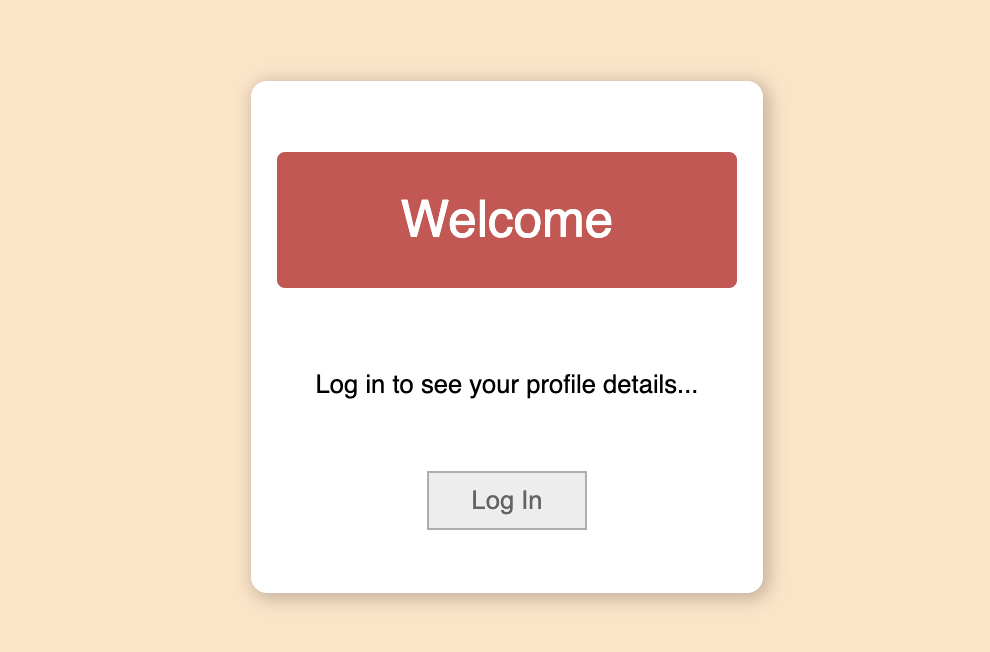
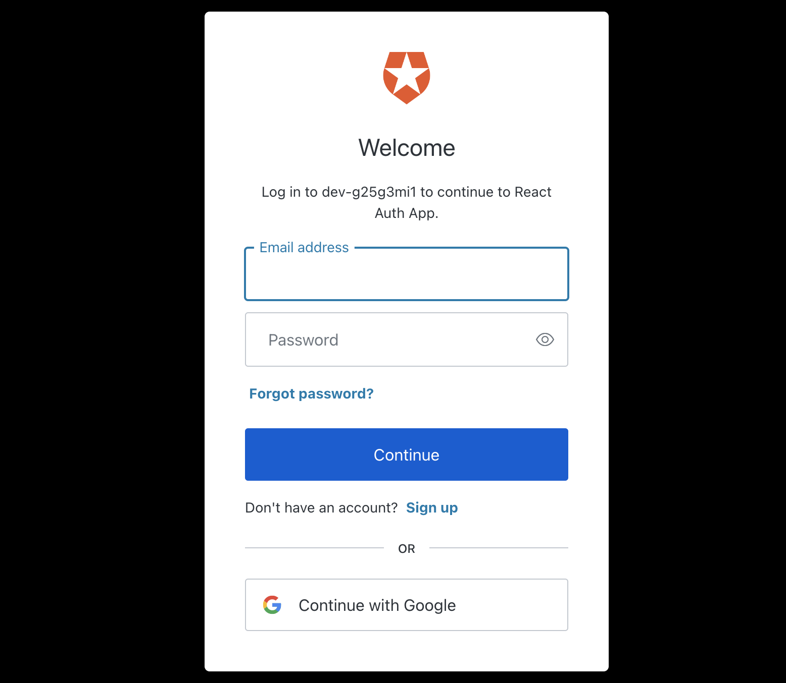
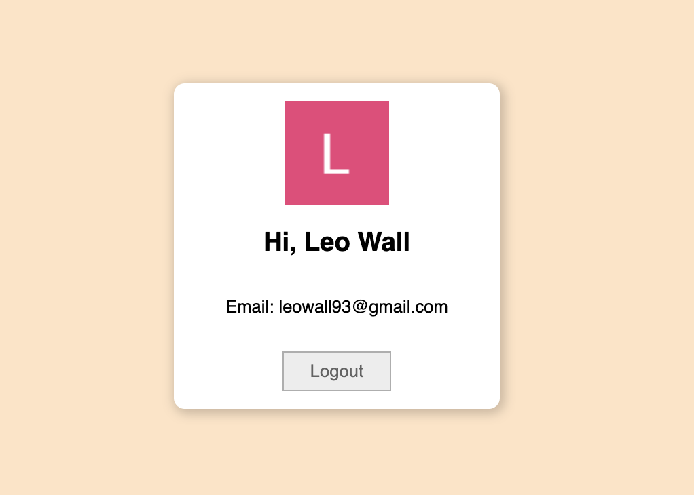

# BASIC AUTH0 APP   

This project I learn how to implenent  Auth0 authentication by creating an app that has a login & logout button, auth0 authentication, and displays profile information once logged in.

There is a basic login page with a login button. Notice this button conditionally renders when the user isn't logged in.

Upon clicking the login button, you'll be taken to the auth0 authenticationn page where you can fill in your login details
.

Once you've logged in, you'll be taken to your profile page.

Here you'll see your name, image and email address. These render dynamically to the user who's logged in.

Also on this page you'll see the log out button, which conditionally renders when the user is authenticated and logged in.

As there is a slight delay between the login being actioned and the profile page rendering, there is a conditional 'loading...' notice, that you can see if you're on the ball.

